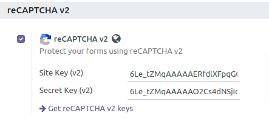
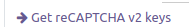
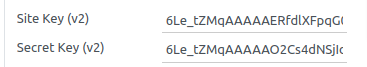

 To configure this module, you need to:

#. Go to **Website > Configuration > Settings**.

#. Search 'reCAPTCHA v2' option.

#. Click the link [Get reCAPTCHA v2 keys](https://www.google.com/recaptcha/admin)
   to generate the keys needed to use the recaptcha.

#. Fill in the generated **Site Key** and **Secret key**.

